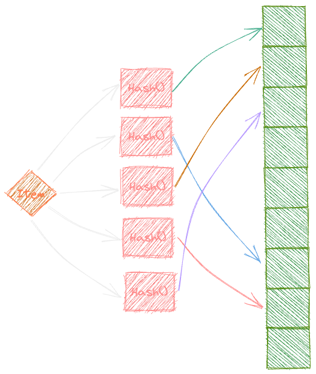

I recently started exploring databases and storage engines more seriously. As a result of my exploration, I started working on a
side project called [USE](https://github.com/tangledbytes/use). USE's one of the storage engine uses very basic append only log
for storing the data on the disk. This means that the `Read(key)` queries are excruciatingly slow as they have to iterate over
the entire log to find the value for the given key. I wanted to minimise the number of disk reads for the `Read(key)` queries especially
for the cases when the `key` is not even present.

This is where it clicked that I can use a Bloom Filter to check if the `key` is present in the log or not. If the `key` is not present
in the log, I can skip the entire log and return `nil` immediately. This would save a lot of disk reads and would make the `Read(key)`
queries much faster.

I knew about the existence of Bloom Filters but I never really understood how they work. So I decided to dig deeper into Bloom Filters.
I wanted to understand how does it work? What are the pros and cons? What are the alternatives?
In this series, I will try to answer these questions and more.

# Bloom Filter
Bloom Filter is a data structure which provides efficient membership testing. So essentially, you can ask the structure if a key `abc` exists
in the structure or not and it will tell you.

It is a probabilistic data structure, which means that it will give you a correct answer with a certain probability. The probability of false positive is
not-zero but the probability of a false negative is 0, which implies that it will **never** tell you that a key exists when it does not.

<details>
<summary>Why not just use a Hash Table? 🤨</summary>
<blockquote>

  Well, the answer is that a hash table is not space efficient. A hash table will use a lot of space for storing the keys.
  A Bloom Filter, on the other hand, will use a lot less space.

  Let's take an example. Suppose we have a hash table with 1000 keys, and we want to store them in a hash table.
  The hash table will use at least 1000 * 8 bytes = 8000 bytes of space (assuming 1 key is 8 bytes in size).
  Now, if we want to store the same keys in a Bloom Filter, we will need 1000 * 1 / 8 bytes = 125 bytes of space.
  So, we can store 64 times more keys in the Bloom Filter than in the hash table. This is a huge difference, and it is the reason why Bloom Filter is so popular.

</blockquote>
</details>

## How does it work?
A basic implementation of Bloom Filter supports 2 kind of operations:
1. `Add(key)`: Add a key to the Bloom Filter
2. `Contains(key)`: Check if a key exists in the Bloom Filter

<!--  -->


The above diagram gives a decent idea of how a Bloom Filter works. The basic idea is that an item is first hashed through multiple hashing
functions and then the bits at the indices returned by the hashing functions are set to 1.

When we want to check if an item exists in the Bloom Filter, we again hash the item through the same hashing functions and check if the bits at the
indices returned by the hashing functions are set to 1. If all the bits are set to 1, then we can say that the item exists in the Bloom Filter.

<details>
<summary>Why use more than 1 hashing function? 🤔</summary>
<blockquote>

  If we use only 1 hashing function then the Bloom Filter will not be very efficient. We haven't yet seen the false positivity
  analysis, so we would rely on intuition.

  Let's take an example by considering the following scenario:
  1. Insert an item `abc`.
      1. Hashing function hashes the item `abc` to index `i`.
      2. We set the bit associated with index `i` to 1.
  2. Check if an item `bca` exists in the Bloom Filter.
      1. Hashing function hashes the item `bca` to index `i` (Hash collsion).
      2. We check if the bit is set to 1 at index `i`.
      3. The bit is set to 1, so we can say that the item `bca` exists in the Bloom Filter.

  In the above scenario, we got a false positive because of the hash collision. Now imagine the scenario where there are more than 1 hash functions,
  in such a scenario the probability that ALL of the hashes will collide will be extremely low. So, we can say that the probability of false positive
  will be low.

</blockquote>
</details>

## False Positive Analysis
We encounter the case of false positive when we check if an item exists in the Bloom Filter and the Bloom Filter tells us that the item exists
when in reality it does not. This can happen only when all the bits at the indices returned by the hashing functions are set to 1.

Hence, in our quest to find the probability of false positive, we need to find the probability of a bit being set to `1` after `n`
items have been inserted into the Bloom Filter. Let's call this probability `p`.

Let's say we have an array of `m` bits and we want to store `n` items in the Bloom Filter. We will use `k` hashing functions to hash the items. Also,
let's denote the event of a bit being 1 after \\(i\\) insertions by \\(j^{th}\\) hashing function as \\(A_{ij}\\) and event \\(A_i\\) denotes the event
of certain bits set to `1` in \\(i^{th}\\) insertion.

Then the probability of false positive is given by (`i.e. equation 1`):


$$
\begin{equation*}
\begin{split}
P(FP) &= p^k \\
\end{split}
\end{equation*}
$$


The probability \\(p\\) can be computed in 2 ways:
1. Calculating \\(P(A_{1} \cup A_{2} \cup \cdots \cup A_{n})\\) as this roughly translates to - the probability of a bit being set to `1` either by
insertion 1 or insertion 2 or insertion 3 or so on.
2. Instead of directly calculating the probability of a bit being set to `1`, we can try to calculate the opposite and then subtract it from `1`.
Calculating the opposite means computing \\(P(A_{1}^\complement \cap A_{2}^\complement \cap \cdots \cap A_{n}^\complement)\\). This roughly translates to -
the probability of a bit being set to `0` by all the insertions.

Using the second approach is easier because insertion of an item is independent of the other insertions. So, we can use
\\(P(A \cap B) = P(A) \times P(B)\\).

Using the above we can find the value of `p` in the following way (`i.e. equation 2`):


$$
\begin{equation*}
\begin{split}
p &=  P\left(\bigcup\limits_{i=1}^{n} A_{i}\right) \\
&= 1 - P\left(\left(A_1 \cup A_2 \cup \cdots \cup A_n \right)^\complement \right) \\
&= 1 - P\left(A_1^\complement \cap A_2^\complement \cap \cdots \cap A_n^\complement \right) \\
&= 1 - \prod\limits_{i=1}^{n} P\left(A_{i}^\complement\right) \\
\end{split}
\end{equation*}
$$


As we calculate \\(P(A_i^\complement)\\) let's <mark>assume that the hashing functions are independent</mark> of each other. This means that
the probability of a bit being set to `1` by hashing function 1 is independent of the probability of a bit being set to `1` by hashing function 2.
This again allows us to use \\(P(A \cap B) = P(A) \times P(B)\\).

Using the above, the probability of the event \\(A_i^\complement\\) is given by (`i.e. equation 3`):


$$
\begin{equation*}
\begin{split}
P(A_i^\complement) &= P((A_{i1} \cup A_{i2} \cup A_{i3} \cup \dots \cup A_{ik})^\complement) \\
&= P(A_{i1}^\complement \cap A_{i2}^\complement \cap A_{i3}^\complement \cap \dots \cap A_{ik}^\complement) \\
&= \prod_{j=1}^{k} P(A_{ij}^\complement) \\
\end{split}
\end{equation*}
$$


Now let's try to find the probability of \\(A_{ij}^\complement\\), which is the probability of a bit being set to `0` by \\(j^{th}\\)
hashing function in \\(i^{th})\\ insertion (`i.e. equation 4`).


$$
\begin{equation*}
\begin{split}
P(A_{ij}^\complement) &= 1 - \frac{1}{m} \\
\end{split}
\end{equation*}
$$


By using the value of \\(P(A_{ij}^\complement)\\) in equation 3, we get (`i.e. equation 5`):


$$
\begin{equation*}
\begin{split}
P(A_i^\complement) &= \prod_{j=1}^{k} \left(1 - \frac{1}{m}\right) \\
&= \left(1 - \frac{1}{m}\right)^k \\
\end{split}
\end{equation*}
$$


Now, we can use the value of \\(P(A_i^\complement)\\) in equation 2 to get the value of `p` (`i.e. equation 6`):


$$
\begin{equation*}
\begin{split}
p &= 1 - \prod\limits_{i=1}^{n} P\left(A_{i}^\complement\right) \\
&= 1 - \prod\limits_{i=1}^{n} \left(1 - \frac{1}{m}\right)^k \\
&= 1 - \left(1 - \frac{1}{m}\right)^{kn} \\
\end{split}
\end{equation*}
$$


Finally, by plugging in the value of `p` in equation 1, we get the probability of false positive (`i.e. equation 7`):


$$
\begin{equation*}
\begin{split}
P(FP) &= \left(1 - \left(1 - \frac{1}{m}\right)^{kn} \right)^k \\
\end{split}
\end{equation*}
$$


\\(P(FP)\\) is also denoted as \\(\varepsilon\\). Therefore (`i.e. equation 8`):,


$$
\begin{equation*}
\begin{split}
\varepsilon &= \left(1 - \left(1 - \frac{1}{m}\right)^{kn} \right)^k \\
\end{split}
\end{equation*}
$$


Also if we assume that the size of the bit array is large enough then (`i.e. equation 9`):,


$$
\begin{equation*}
\begin{split}
\lim_{m\to\infty} \left(1 - \frac{1}{m}\right)^{kn} &= \lim_{m\to\infty} \left(\left(1 - \frac{1}{m}\right)^{m}\right)^{\frac{kn}{m}} \\
&= e^{-\frac{kn}{m}} \\
\end{split}
\end{equation*}
$$


Using the above deductions to simplify equation 8, we get (`i.e. equation 10`):,


$$
\begin{equation*}
\begin{split}
\varepsilon &\approx \left(1 - e^{-\frac{kn}{m}} \right)^k \\
\end{split}
\end{equation*}
$$


## Optimal values
Now that we have identified the equation for calculating the probability of false positive, we can use it to find the optimal values of `k` and `m`.

### Number of hashing functions
The optimal case is the one where the false positive rate is minimised for a given filter size of `m`. Calculus 101 tells us that we can find the
minima/maxima of a function by finding the point where the derivative is equal to `0`. So, let's find the derivative of \\(\varepsilon\\) with respect to `k` (`i.e. equation 11`):


$$
\begin{equation*}
\begin{split}
\frac{d\varepsilon}{dk} &= \frac{d}{dk}\left(1 - \left(1 - \frac{1}{m}\right)^{kn} \right)^k \\
&= \left(1 - \left(1 - \frac{1}{m} \right)^{nk} \right)^{k}
    \cdot
  \left(\left(\frac{\ln{\left(1 - \frac{1}{m}\right)^{-nk}} \cdot \left(1 - \frac{1}{m} \right)^{nk}}{1 - \left(1 - \frac{1}{m}\right)^{nk}} \right)
    +
  \ln{\left(1 - \left(1 - \frac{1}{m}\right)^{nk} \right)} \right)
\end{split}
\end{equation*}
$$


Now, let's set the derivative equal to `0` and solve for `k`, it should be noted that in equation 11 \\(\left(1 - \left(1 - \frac{1}{m} \right)^{nk} \right)^{k}\\) can
never really be 0 (because it is an exponential function). So, we can safely ignore that term and solve for `k` (`i.e. equation 12`):


$$
\begin{equation*}
\begin{split}
\left(\left(\frac{\ln{\left(1 - \frac{1}{m}\right)^{-nk}} \cdot \left(1 - \frac{1}{m} \right)^{nk}}{1 - \left(1 - \frac{1}{m}\right)^{nk}} \right)
  +
\ln{\left(1 - \left(1 - \frac{1}{m}\right)^{nk} \right)} \right) &= 0 \\
\end{split}
\end{equation*}
$$


Let \\(\left(1 - \frac{1}{m}\right)^{nk}\\) be \\(t\\), then we get:

$$
\begin{equation*}
\begin{split}
\frac{-\ln{\left(t\right)} \cdot t}{1 - t} + \ln{(1 - t)} &= 0 \\
(1 - t)\ln{(1 - t)} &= t\ln{t} \\
1 - t &= t \\
t &= \frac{1}{2} \\
\end{split}
\end{equation*}
$$


Using the value of \\(t\\) to get the value of `k`:

$$
\begin{equation*}
\begin{split}
\left(1 - \frac{1}{m}\right)^{nk} &= \frac{1}{2} \\
{nk}\ln{\left(1 - \frac{1}{m}\right)} &= -\ln{2} \\
k &= \frac{-\ln{2}}{n \ln{\left(1 - \frac{1}{m}\right)}} \\
\end{split}
\end{equation*}
$$


It can be shown using Taylor expansion that for the cases where \\( m \gg 1 \\), \\( \ln{\left(1 - \frac{1}{m}\right)} \approx -\frac{1}{m} \\), therefore the optimal value
turns out to be,

<strong>

$$
\begin{equation*}
\begin{split}
k &= \frac{m}{n} \ln{2} \\
\end{split}
\end{equation*}
$$

</strong>

### Size of the bit array
The optimal case is the one where the false positive rate is minimised for a given number of hashing functions of `k`. In the previous section, we found that the
optimal number of hashing functions is \\(k = \frac{m}{n} \ln{2}\\). So, we can use that to find the optimal size of the bit array by subsituting the value of `k` in equation 10,
we get the value of `m` to be:

<strong>

$$
\begin{equation*}
\begin{split}
m &= - \frac{n \ln{\varepsilon}}{(\ln{2})^2} \\
\end{split}
\end{equation*}
$$

</strong>

## Implementation
With all the hardwork we can now finally look at the implementation of the Bloom filter. We will look at implementation in Golang.
Too much talk, let's directly dive into the code now!

### BitSet
We will need BitSet for our implementation of Bloom Filter so lets start with that.


Use 64 bits to represent a single unit of bitset.
```go
const BitsetUnitSize = 64
```



Bitset struct holds the internal state of the bitset.
```go
type Bitset struct {
  // bits is the underlying bitset.
  bits []uint64
  // size is the size of the bitset.
  size uint64
}
```



Set operation is constructed by performing a bitwise OR operation on the target bitset unit and the bitset unit that is constructed by shifting `1` to the left by `index` bits.
```go
func (b *Bitset) Set(index uint64) {
  b.bits[index/BitsetUnitSize] |= 1 << (index % BitsetUnitSize)
}
```



Get operation is constructed by performing a bitwise AND operation on the target bitset unit and the bitset unit that is constructed by shifting `1` to the left by `index` bits.
```go
func (b *Bitset) Get(index uint64) bool {
  return b.bits[index/BitsetUnitSize]&(1<<(index%BitsetUnitSize)) != 0
}
```



Count operation is constructed by counting the number of bits set to `1` in the bitset. The given implementation uses the [Hamming weight](https://en.wikipedia.org/wiki/Hamming_weight) algorithm.
This is a naive implementation and can maybe improved by using popcount instruction.
```go
func (b *Bitset) Count() int {
  var count int
  for _, bits := range b.bits {
    for bits != 0 {
      bits &= bits - 1
      count++
    }
  }

  return count
}
```


### Bloom Filter
Now that we have the BitSet implementation out of the way, we can now look at the Bloom Filter implementation.


BloomFilter struct holds the internal state of the Bloom Filter.
```go
type BloomFilter struct {
  // bitset is the underlying bitset.
  bitset *Bitset
  // hashers is the list of hash functions.
  hashers []func([]byte) uint64
}
```



NewBloomFilter creates a new Bloom Filter with the given size and number of hash functions. This blog intentionally
receives the hashers from the caller so as to not waste time on talking about specifics of hash functions.
```go
func NewBloomFilter(size uint64, hashers []func([]byte) uint64) *BloomFilter {
  return &BloomFilter{
    bitset:  NewBitset(size),
    hashers: hashers,
  }
}
```



Add operation adds the given key to the Bloom Filter. The function will hash the key using the hash functions and set the corresponding bits in the bitset.
```go
func (b *BloomFilter) Add(key []byte) {
  for _, hasher := range b.hashers {
    b.bitset.Set(hasher(key))
  }
}
```



Contains operation checks if the given key is present in the Bloom Filter. Contains operation will hash the key using the hash functions and
check if the corresponding bits in the bitset are set. If any of the bit is not set then it will return `false`.
```go
func (b *BloomFilter) Contains(key []byte) bool {
  for _, hasher := range b.hashers {
    if !b.bitset.Get(hasher(key)) {
      return false
    }
  }

  return true
}
```


# Conclusion
In this blog we saw:
- What is Bloom Filter
- How Bloom Filter works
- How to calculate the optimal number of hashing functions and size of the bit array
- How to implement Bloom Filter in Golang

But there are still some questions left unanswered:
- What if I want to delete a key from the Bloom Filter?
- Are there other more efficient ways to implement Bloom Filter?

The answer to the above questions are more such questions will be part of the next blog in this series. Stay tuned!
